# 📊 Adaptive Statistical Arbitrage using Kalman Filter

## 🧩 Overview

This project implements a **market-neutral pairs trading strategy** using a **dynamic hedge ratio** estimated via a **Kalman Filter**.

Unlike traditional approaches that assume a constant relationship between assets, this model adapts to **time-varying market conditions** using a **state-space framework**, enabling more robust performance in evolving markets.

---

## 🧠 Motivation

Traditional pairs trading relies on a **static hedge ratio (OLS regression)**, which fails in dynamic environments where relationships between assets change over time.

This project addresses that limitation by:

- Modeling the hedge ratio as a **time-varying latent state**  
- Using a **Kalman Filter** for sequential estimation  
- Capturing short-term deviations while maintaining long-term equilibrium  

---

## 📈 Strategy Overview

### 🔁 Pairs Trading

Pairs trading is a **statistical arbitrage strategy** that exploits temporary deviations between two related assets.

- Long undervalued asset  
- Short overvalued asset  
- Profit from **mean reversion of the spread**  

---

### ⚖️ Hedge Ratio

The hedge ratio defines relative position sizing:

$$
\text{spread}_t = p_{1,t} - \beta_t \cdot p_{2,t}
$$

- Ensures **market neutrality**  
- $\beta_t$ is **time-varying**, estimated using a Kalman Filter  

---

### 🔗 Correlation vs Cointegration

| Concept       | Meaning                            |
|--------------|------------------------------------|
| Correlation   | Short-term co-movement             |
| Cointegration | Long-term equilibrium relationship |

- Correlation is used for initial filtering  
- Cointegration validates tradable pairs  

---

## 🧮 Methodology

### 1️⃣ Data Collection
- Historical price data using `yfinance`  
- Daily closing prices used for analysis  

### 2️⃣ Pair Selection
- Correlation filtering  
- Cointegration testing (Engle-Granger)  

### 3️⃣ State-Space Model

**State Equation:**

$$
\beta_t = \beta_{t-1} + \text{noise}
$$

**Observation Equation:**

$$
p_{1,t} = \beta_t \cdot p_{2,t} + \alpha_t + \text{noise}
$$
---

### 4️⃣ Kalman Filter
- Predict → Update cycle  
- Produces **dynamic hedge ratio ($\beta_t$)**  
- Adapts to changing market relationships  

---

### 5️⃣ Signal Generation
- Spread construction  
- Z-score normalization  

| Condition      | Action       |
|----------------|--------------|
| $Z > +1$       | Short spread |
| $Z < -1$       | Long spread  |
| $Z \approx 0$  | Exit         |

---

### 6️⃣ Backtesting
- Position management  
- PnL and returns calculation  
- Performance evaluation (with and without transaction costs)  

---

## 📊 Results

The strategy is evaluated across multiple asset pairs and time periods. For each case, we present both the **trading signals** and the resulting **cumulative returns**.

---

### 📈 V vs MA (2012–2013)

<table>
<tr>
<td align="center"><b>Trading Signals</b></td>
<td align="center"><b>Cumulative Returns</b></td>
</tr>
<tr>
<td>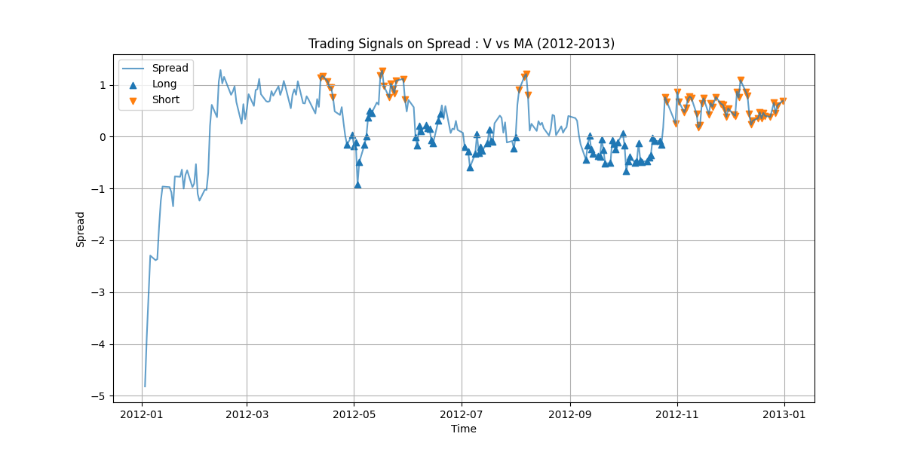</td>
<td>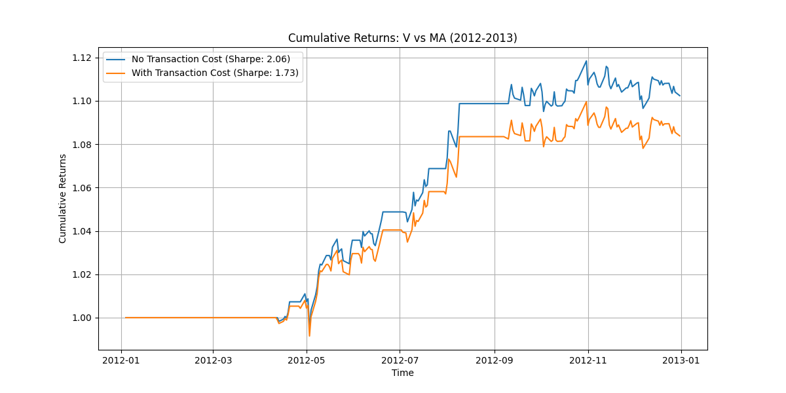</td>
</tr>
</table>

---
### 📈 V vs MA (2013–2014)

<table>
<tr>
<td align="center"><b>Trading Signals</b></td>
<td align="center"><b>Cumulative Returns</b></td>
</tr>
<tr>
<td>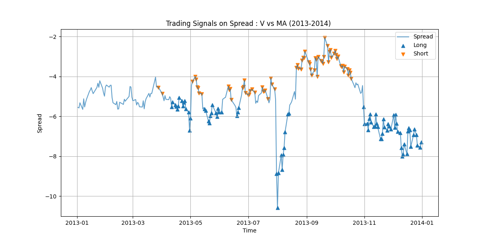</td>
<td>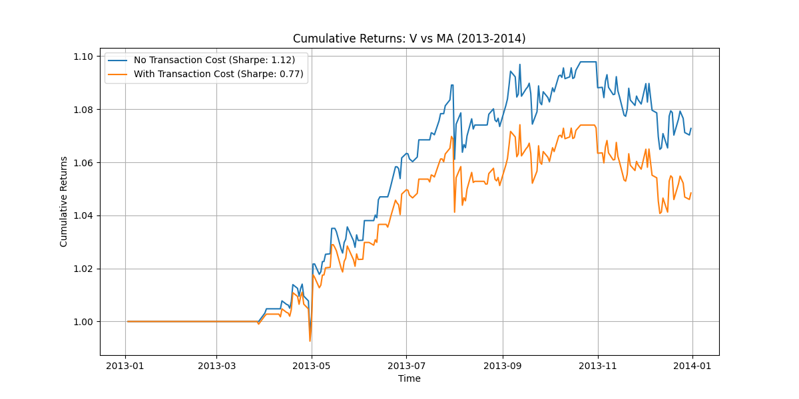</td>
</tr>
</table>

---
### 📈 V vs MA (2014–2015)

<table>
<tr>
<td align="center"><b>Trading Signals</b></td>
<td align="center"><b>Cumulative Returns</b></td>
</tr>
<tr>
<td>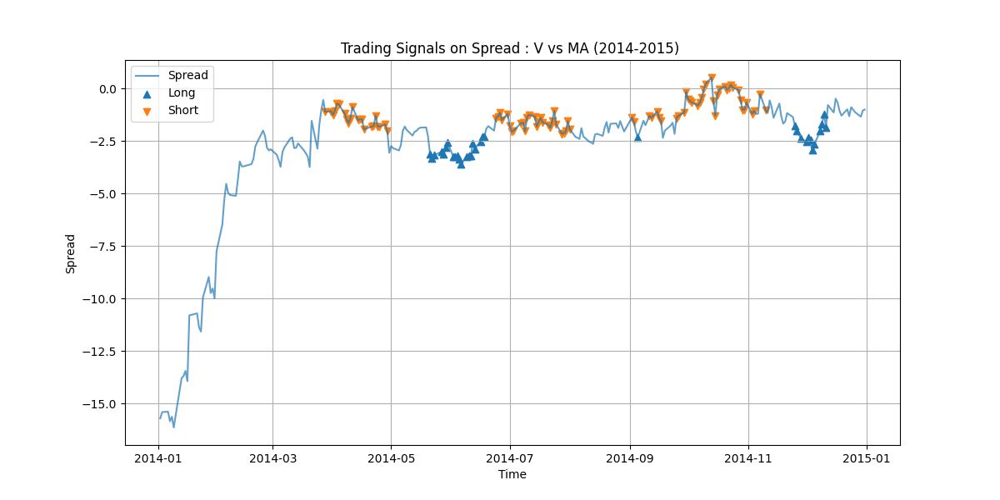</td>
<td>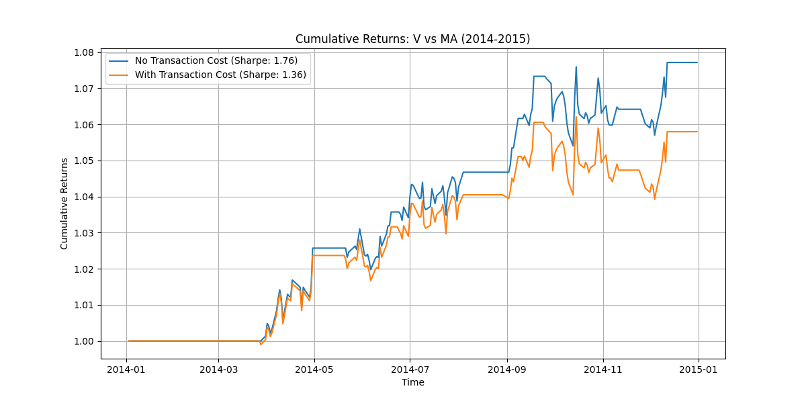</td>
</tr>
</table>

---

### 📈 V vs MA (2015–2016)

<table>
<tr>
<td align="center"><b>Trading Signals</b></td>
<td align="center"><b>Cumulative Returns</b></td>
</tr>
<tr>
<td>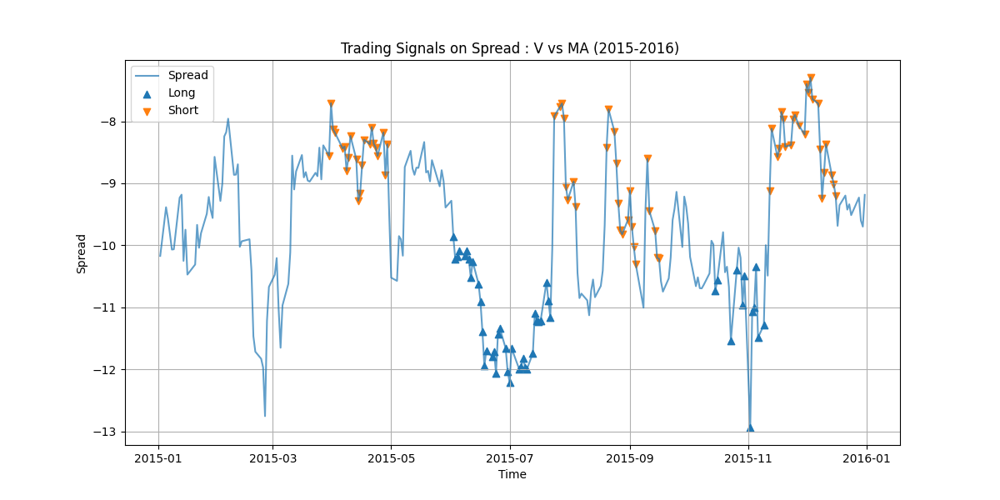</td>
<td>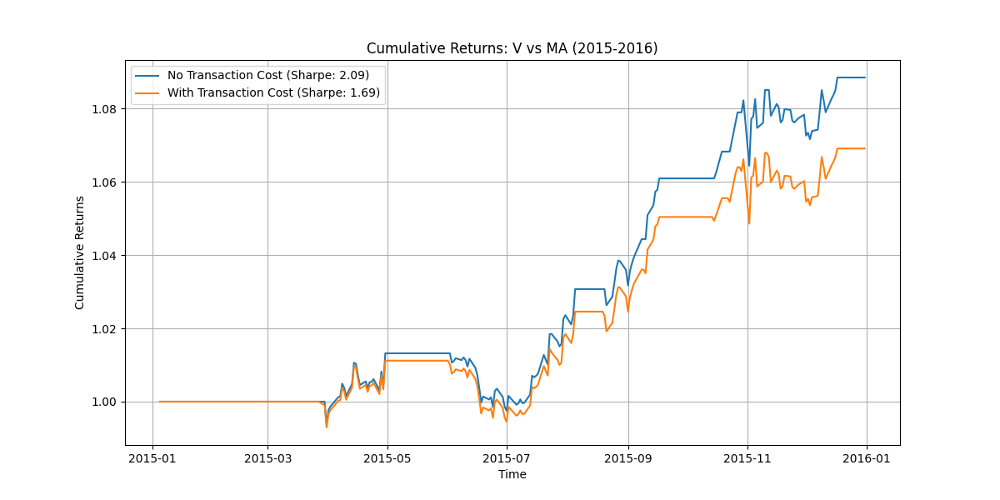</td>
</tr>
</table>

---

### 📈 KO vs PEP (2013–2014)

<table>
<tr>
<td align="center"><b>Trading Signals</b></td>
<td align="center"><b>Cumulative Returns</b></td>
</tr>
<tr>
<td>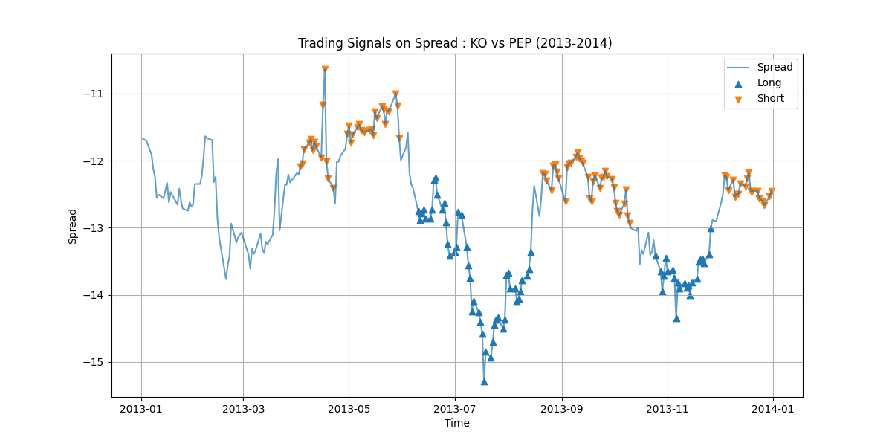</td>
<td>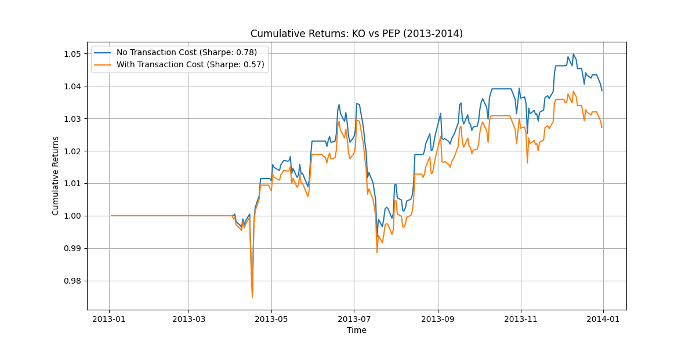</td>
</tr>
</table>

---

### 📈 KO vs PEP (2014–2015)

<table>
<tr>
<td align="center"><b>Trading Signals</b></td>
<td align="center"><b>Cumulative Returns</b></td>
</tr>
<tr>
<td>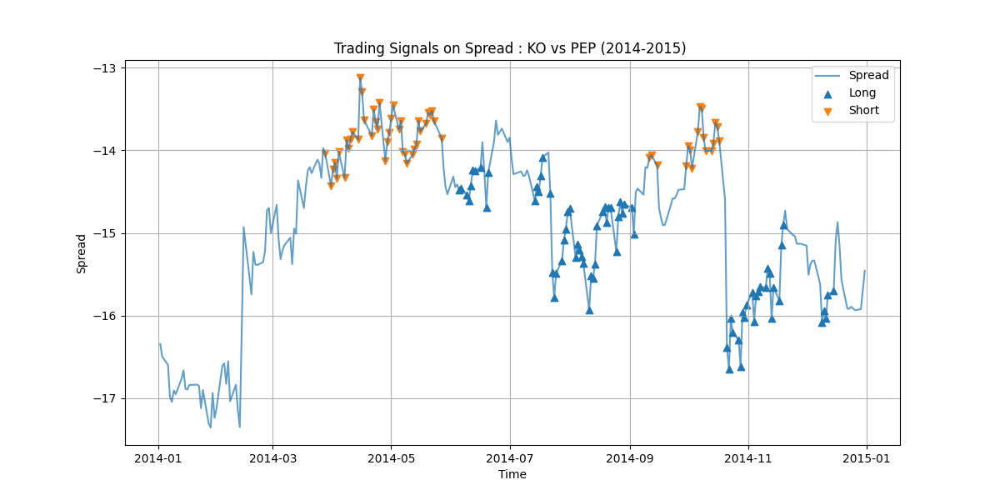</td>
<td>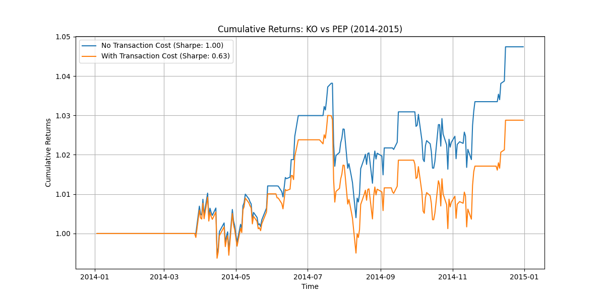</td>
</tr>
</table>

---
### 📈 KO vs PEP (2015–2016)

<table>
<tr>
<td align="center"><b>Trading Signals</b></td>
<td align="center"><b>Cumulative Returns</b></td>
</tr>
<tr>
<td>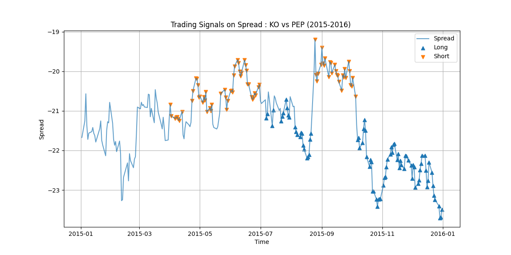</td>
<td>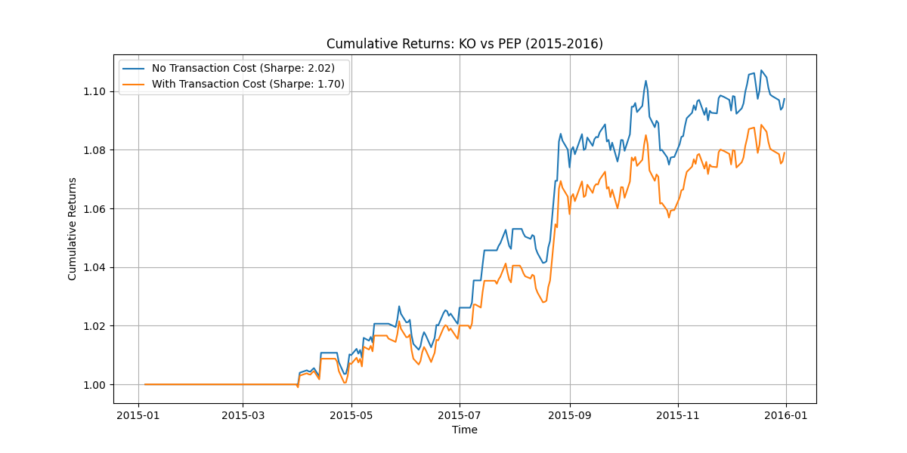</td>
</tr>
</table>

---


### 🧠 Observations

- Trading signals align closely with deviations in the spread  
- Z-score thresholds effectively capture entry and exit points  
- Strategy performance varies across different pairs and time periods  
- Transaction costs reduce returns but the core strategy remains robust  

## 🔥 Key Features

- ✅ Dynamic hedge ratio using Kalman Filter  
- ✅ Market-neutral statistical arbitrage  
- ✅ Cointegration-based pair selection  
- ✅ Adaptive mean-reversion strategy  
- ✅ Transaction cost analysis  
- ✅ Multi-pair evaluation across different time periods  

---

## 🛠️ Tech Stack

- Python  
- NumPy / Pandas  
- Matplotlib  
- statsmodels  
- pykalman  
- yfinance  

---

## ▶️ How to Run

```bash
git clone https://github.com/yourusername/adaptive-stat-arb-kalman.git
cd adaptive-stat-arb-kalman
pip install -r requirements.txt
python main.py

---

## 🚀 Future Improvements

- Extend to a **multi-pair portfolio** instead of a single pair  
- Incorporate **more realistic transaction cost and slippage models**    
- Add **risk management techniques** (position sizing, stop-loss)  
- Explore **alternative signals** (machine learning or regime detection)  

---